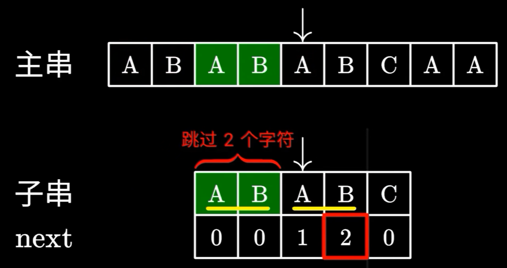

<p align="center">
<a href="https://www.programmercarl.com/xunlian/xunlianying.html" target="_blank">
  
</a>
<p align="center"><strong><a href="./qita/join.md">参与本项目</a>，贡献其他语言版本的代码，拥抱开源，让更多学习算法的小伙伴们受益！</strong></p>


> 在一个串中查找是否出现过另一个串，这是 KMP 的看家本领。

# 28. 实现 strStr()

[力扣题目链接](https://leetcode.cn/problems/find-the-index-of-the-first-occurrence-in-a-string/)

实现 strStr() 函数。

给定一个 haystack 字符串和一个 needle 字符串，在 haystack 字符串中找出 needle 字符串出现的第一个位置 (从0开始)。如果不存在，则返回  -1。

```
示例 1:
输入: haystack = "hello", needle = "ll"
输出: 2

示例 2:
输入: haystack = "aaaaa", needle = "bba"
输出: -1
```

说明：当 needle 是空字符串时，应当返回什么值呢？这是一个在面试中很好的问题。

对于本题而言，当 needle 是空字符串时应当返回 0 。这与C语言的 strstr() 以及 Java的 indexOf() 定义相符。

> 疑问：
>
> 以实例 1 为例，如果模式串是空串就返回 0 的话。那么当 needle="h"，返回也是 0，这时该如何解释两个不同的模式串，返回了相同的结果？


## 算法公开课

本题是 KMP 经典题目。以下文字如果看不进去，可以看[《代码随想录》算法视频公开课](https://programmercarl.com/other/gongkaike.html)，相信结合视频再看本篇题解，更有助于大家对本题的理解。

* [帮你把KMP算法学个通透！B站（理论篇）](https://www.bilibili.com/video/BV1PD4y1o7nd/)
* [帮你把KMP算法学个通透！（求next数组代码篇）](https://www.bilibili.com/video/BV1M5411j7Xx)

参考：

[最浅显易懂的 KMP 算法讲解]: https://www.bilibili.com/video/BV1AY4y157yL/?spm_id_from=333.337.search-card.all.click&amp;vd_source=4f2caa483363742401353d2113a4e793


# 绪论

## 暴力匹配

主串一个字一个字地与模式串进行匹配，一旦匹配失败，就跳回主串的下一字符，模式串重新从头匹配。

这个算法原理很简单，实现起来也十分容易，但最大的问题在于它的时间复杂度，如果运气不好，恰好主串和模式串都是若干个 A 后接一个 B 的情况，这时候算法会很傻地把前面的 A 都比对完，然后发现最后一个 B 不匹配，做了不少无用功

这是一个 O(n * m) 时间复杂度的算法，效率极低


## KMP 来历

因为是由这三位学者发明的：Knuth，Morris 和 Pratt，所以取了三位学者名字的首字母。

这时有三位大佬 KMP，他们就想，既然字符串在比对失败时，已经直到之前都读过哪些字符了，有没有可能避免“跳回下一个字符再重新匹配”的步骤呢？

换句话说，希望不回退主串的指针，而让它永远只往后移动！

> 修正：
>
> 本文所有图中的“子串”应改为“模式串”


于是他们就发表了线性时间复杂度的 KMP 算法，换句话说，只需要在一次主串的遍历过程中，就可以匹配出模式串


## KMP 作用

举个例子，这里在主串中搜索模式串 `ABABC`，发现最后一个字符 C 不匹配


此时，由于已经知道前面都匹配过哪些字符，是不是可以将模式串的索引直接移动到如图这个位置，接着进行匹配呢？


由于这里模式串的 AB 和主串的 AB 是相同的，可以完全跳过它们，避免重复的比对，接下来只需要继续比对后面的字符就好了

如何知道应该要跳过多少个字符呢？这里就要用到 KMP 中定义的 next 数组了


# next 数组 / 前缀表

## 什么是前缀表

> 提示：不同的资料对 `next[]` 的定义可能略有不同。[视频](https://www.bilibili.com/video/BV1AY4y157yL/?spm_id_from=333.337.search-card.all.click&vd_source=4f2caa483363742401353d2113a4e793)中`next[i]`表示以第 i 个元素结尾的最大前缀的下一个位置（如果规定下标从 0 开始，它同时也等于已匹配的最长前缀 prefix_len）；然而有些资料可能定义`next[i]`为：位置 i 失配后应该跳转到的位置，所以代码有所不同。甚至规定下标从 0 还是 1 开始，也可能对代码有所影响
>
> 所以 100 个人可以有 100 种 KMP 的写法，理解的时候建议不要交叉比较，否则容易被细节搞晕，摁着一个看明白就行。

写过 KMP 的同学，一定都写过 next 数组，那么这个 next 数组究竟是个啥呢？next 数组就是前缀表（prefix table）。

为了清楚地了解前缀表的作用，来举一个例子：要在文本串`aabaabaafa` 中查找模式串`aabaaf`。查找过程如动画所示：


> 动画里，特别标记了子串`aa` ，事出有因，先注意一下，后面还会说到。

可以看出，文本串中第 6 个字符 b，和模式串的第 6 个字符 f 不匹配了。如果是暴力匹配，此时就要从头匹配了。

但如果使用前缀表，就不会从头匹配，而是从上次已经匹配的内容开始匹配，找到了模式串中第 3 个字符 b 继续匹配。


## next 数组作用

先不管 next 数组是如何生成的，来看一下它的功能和用途

KMP 算法在匹配失败时，会去找最后一个匹配成功的字符对应的 next 数值，比如这里是 2


于是移动模式串下标，直接跳过前 2 个字符，到 A 的位置


这里的 2，代表可以**跳过匹配**的字符个数，也就是说前 2 个字符 AB 可以不用看了，直接从下一个字符接着匹配，显然这样是没问题的

由于不需要回退主串中的指针，只需一次主串的遍历即可完成匹配，效率自然比之前的暴力算法高很多


## 省略：匹配算法实现

由于匹配算法比较简单，就不重点介绍匹配算法了，直接看代码就可以理解

假设已经生成了 next 数组了

```python
def kmp_search():
    next = build_next(patt) # 假设已经计算出了 next 数组（后文会讲到）
    i = 0 # 主串中的指针
    j = 0 # 模式串中的指针
    while i < len(string):
        if string[i] == patt[j]: # 字符匹配，指针后移
            i += 1
            j += 1
        elif j > 0: # 失配，根据 next 数组跳过已匹配的字符
            j = next[j - 1]
        else: # 模式串第一个字符就失配
            i += 1
            
        if j == len(patt): # 匹配成功
            return i - j
```

注意这里主串的指针 i，**永不回退**（never backup），这是 KMP 算法的**精髓**

## 最长相等前后缀

文章中，字符串的前缀是指**不包含最后一个字符**的所有以第一个字符开头的连续子串。后缀是指**不包含第一个字符**的所有以最后一个字符结尾的连续子串。

**正确理解什么是前缀什么是后缀很重要!**

**摒弃最长公共前后缀的说法**：因为前缀表要求的就是相同的前后缀的长度。而最长公共前后缀里面的“公共”，更像是说前缀和后缀公共的长度。

所以，字符串 a 的最长相等前后缀为 0。aa 的为 1。aaa 的为2。等等.....。

> 注意：
>
> `acbca` 的最长相等前后缀是`a`，而不是`ac`，后缀不是逆序截取的

## next 数组的计算


next 数值表示，在后一个元素匹配失败时，子串中可以跳过匹配的字符个数。但凭什么可以这么做呢？



因为之前成功匹配的最后这两个字符 AB，和跳过的最前面两个 AB，是完全一样的。也就是说，对于模式串的前 4 个字符，有一个相等的前后缀 AB

因此，next 数组的本质，就是寻找相等的前后缀长度，且是最长的前后缀

比如这里的 A 和 A 相同，但它并不是最长的，这里还有一个更长的 ABA，因此 `next[6] = 3;`


另外，找的前后缀不能是字符串本身，比如下面总共就 4 个字符，如果还跳过前 4 个字符的比较，那就没意义了


**下面以 ABABC 为例，来说明 next 数组的计算**

1. 对于第 1 个字符，显然不存在比它短的前后缀，因此 `next[0] = 0;`
2. 对于前 2 个字符，同样没有相同的前后缀，因此 `next[1] = 0;`
3. 对于前 3 个字符，由于 A 是相同的前后缀，因此 `next[2] = 1;`
4. 对于前 4 个字符，由于 AB 是相同的前后缀，因此 `next[3] = 2;`
5. 对于前 5 个字符，没有相同的前后缀，因此 `next[4] = 0;`

这样就计算得到了整个 next 数组


## next 算法实现：动规方式


KMP 一直有疑惑的点就是这个 next 数组的计算了。以视频中的案例为例，发现第 i 个元素的值，是与第 i - 1 个元素密切相关的，因此，可以尝试使用动态规划的思想来处理

### 一、定义 next[i] 以及下标 i

next[i] 表示，以第 i 个元素结尾的字符串，其最长相等前后缀的长度

注意：需要时刻牢记这里的定义，KMP 的 next 数组定义有很多种，虽然原理都相同，但是一旦搞混，那下一步就很难进行下去

### 二、确定状态转移方程

> 对于 KMP 的 next 数组，无法提炼出一个一致性较高的公式，比如无法像斐波那契数列那样可以直接推导出 `dp[i] = dp[i - 1] + dp[i - 2];`

动态规划思想要点：后一个状态所有的信息完全由前一个状态推导出来。已知 next[i] 的定义，那么，next[i - 1] 就表示以 前一个字符结尾的子串 的最长相等前后缀长度，同时也可以表示当前 遍历到的前缀的下标位置

> 比如，当前遍历到最后一个字符 B（i = 7），那么，next[i - 1] = next[6] = 3，3 为上一个相等前后缀 ABA 的长度，同时也是 C 的位置
>
> 可以发现：模式串的遍历分为前缀的遍历和后缀的遍历，用 i 表示遍历后缀下标，j 表示遍历前缀的下标。


此时 B 和 C 不匹配，既然 ABA 无法与 B 组成最长相等前后缀，那么就看其中存不存在更短的，比如 A 就可以与 B 组成当前的最长相等前后缀


这一步如何计算呢？根据之前的计算掌握了一个信息，就是右边这部分后缀的前缀（ABA）等于左边部分的前缀的前缀（ABA），既然要找更短的前后缀，那么新的最长相等前后缀，一定在 ABA 中。


因此问题变成：在 ABAB 中，找出最长相等前后缀。将 B(i = 7)与前缀 ABA 看成一个新的字符串，或者说把前缀的 next 数值全部暂时赋给后缀，重新求 B 的 next 值，即：


查表得出，前一个最长相等前后缀长度是 1，于是又回到了最开始的步骤，检查下一个字符是否相同，B 和 B 相等，于是，next[7] = next[2] + 1;

### 三、初始化

整个数组初始化为 0

### 四、遍历顺序

next[i] 与 next[i - 1] 有关，因此数组是从前往后遍历

### 五、举例推导

手动推导一次 next 数组，然后与代码打印比较

最后所得出的代码如下

```java
/**
 * next[i] 表示以第 i 个字符结尾的子串的最长相等前后缀长度
 * @param s 待生成前缀表的模式串
 * @return 返回前缀表
 */
private int[] getNext(String s) {
    int[] next = new int[s.length()];
    // next[0] = 0; // java 无需初始 0

    // 匹配前后缀
    for (int i = 1; i < s.length(); i++) {
        // 找当前 遍历前缀最后一个字符的下标
        int j = next[i - 1];
        // 当前遍历的 前缀 和 后缀不匹配时，把前缀索引 j 缩小到下一个匹配位置
        while (j > 0 && s.charAt(j) != s.charAt(i)) {
            j = next[j - 1];
        }
        if(s.charAt(j) == s.charAt(i)) { // 匹配上，则当前 next 值 = 上一前后缀长度 + 1
            next[i] = j + 1;
        } else { // 一直匹配不上，则当前 前后缀长度为 0
            next[i] = 0; // next[i] = j;
        }
    }
    return next;
}
```


## 时间复杂度分析

n 为文本串长度，m 为模式串长度

在匹配过程中，根据前缀表不断调整匹配位置，可以看出匹配的过程是 O(n)

匹配前还要单独生成前缀表，时间复杂度是 O(m)

所以整个 KMP 算法的时间复杂度是 O(n+m)

而暴力解法是 O(n × m)，所以 **KMP 在字符串匹配中极大地提高了搜索效率。**


# 附录

## 前缀表的另 2 种计算方式

1. 原始前缀表统一减 1，作为新前缀表

   - 文本串       ： a a b a a b a a f a

   - 模式串下标： 0 1 2 3 4 5

   - 模式串       ： a a b a a f

   - 前缀表       ：-1 0-1 0 1-1

     此时 i=5 位置 f 失配，跳转位置为前一个一匹配位置的值加一，next[4] + 1=2

2. 原始前缀表统一右移一位，右移补 0，作为新前缀表

   - 文本串       ： a a b a a b a a f a

   - 模式串下标： 0 1 2 3 4 5

   - 模式串       ： a a b a a f

   - 前缀表       ： 0 0 1 0 1 2

     此时 i=5 位置 f 失配，跳转位置为前一个一匹配位置的值加一，next[4] + 1=2

> - [ ] 初始值需要再做分析

## 前缀表减一：不好理解，废弃

### next 数组匹配流程

**下面以原始前缀表减 1 后的数组来做演示**。

有了 next 数组，就可以根据 next 数组来匹配文本串 haystack ，和模式串 needle 了。

注意 next 数组是新前缀表。

匹配过程如动画所示：


### 构造前缀表

定义一个方法来构建前缀表，方法参数为指向 next 数组的指针和模式串 needle。代码如下：

```cpp
void getNext(int* next, const string& needle)
```

主要有 3 个步骤：

1. 初始化
2. 处理前后缀不等的情况
3. 处理前后缀相等的情况

详解一下。

1. 初始化：

定义两个指针 i 和 j，j 指向前缀末尾，i 指向后缀末尾。

> i, j 定义通常用于循环，i 用于外层循环，j 用于内层循环

然后对 next 数组进行初始化赋值，如下：

```cpp
int j = -1;
next[0] = j;
```

为什么要初始化 j 为 -1 呢，因为之前说过，前缀表要统一减 1，这是其中一种实现。下文还会给出 j 不初始化为 -1 的实现代码。

next[i] 表示 i（包括 i）之前最长相等的前后缀长度（其实就是 j），所以初始化 next[0] = j 。


2. 处理前后缀不等的情况


因为 j 初始化为 -1，那么 i 就从 1 开始，比较 `needle[i]` 与 `needle[j + 1]`。

所以遍历模式串 needle 的循环下标i 要从 1开始，代码如下：

```cpp
for (int i = 1; i < needle.size(); i++) {
```

如果 `needle[i]` 与 `needle[j + 1]`不等，也就是遇到 前后缀末尾不相同的情况，就要向前回退。

怎么回退呢？

next[j]就是记录着j（包括j）之前的子串的相同前后缀的长度。

那么 s[i] 与 s[j+1] 不相同，就要找 j+1前一个元素在next数组里的值（就是next[j]）。

所以，处理前后缀不相同的情况代码如下：

```cpp
while (j >= 0 && s[i] != s[j + 1]) { // 前后缀不相同了
    j = next[j]; // 向前回退
}
```

3. 处理前后缀相同的情况

如果 s[i] 与 s[j + 1] 相同，那么就同时向后移动i 和j 说明找到了相同的前后缀，同时还要将j（前缀的长度）赋给next[i], 因为next[i]要记录相同前后缀的长度。

代码如下：

```
if (s[i] == s[j + 1]) { // 找到相同的前后缀
    j++;
}
next[i] = j;
```

最后整体构建next数组的函数代码如下：

```CPP
void getNext(int* next, const string& s){
    int j = -1;
    next[0] = j;
    for(int i = 1; i < s.size(); i++) { // 注意i从1开始
        while (j >= 0 && s[i] != s[j + 1]) { // 前后缀不相同了
            j = next[j]; // 向前回退
        }
        if (s[i] == s[j + 1]) { // 找到相同的前后缀
            j++;
        }
        next[i] = j; // 将j（前缀的长度）赋给next[i]
    }
}
```


代码构造next数组的逻辑流程动画如下：


得到了next数组之后，就要用这个来做匹配了。

### 使用next数组来做匹配

在文本串s里 找是否出现过模式串t。

定义两个下标j 指向模式串起始位置，i指向文本串起始位置。

那么j初始值依然为-1，为什么呢？ **依然因为next数组里记录的起始位置为-1。**

i就从0开始，遍历文本串，代码如下：

```cpp
for (int i = 0; i < s.size(); i++) 
```

接下来就是 s[i] 与 t[j + 1] （因为j从-1开始的） 进行比较。

如果 s[i] 与 t[j + 1] 不相同，j就要从next数组里寻找下一个匹配的位置。

代码如下：

```cpp
while(j >= 0 && s[i] != t[j + 1]) {
    j = next[j];
}
```

如果 s[i] 与 t[j + 1] 相同，那么i 和 j 同时向后移动， 代码如下：

```cpp
if (s[i] == t[j + 1]) {
    j++; // i的增加在for循环里
}
```

如何判断在文本串s里出现了模式串t呢，如果j指向了模式串t的末尾，那么就说明模式串t完全匹配文本串s里的某个子串了。

本题要在文本串字符串中找出模式串出现的第一个位置 (从0开始)，所以返回当前在文本串匹配模式串的位置i 减去 模式串的长度，就是文本串字符串中出现模式串的第一个位置。

代码如下：

```cpp
if (j == (t.size() - 1) ) {
    return (i - t.size() + 1);
}
```

那么使用next数组，用模式串匹配文本串的整体代码如下：

```CPP
int j = -1; // 因为next数组里记录的起始位置为-1
for (int i = 0; i < s.size(); i++) { // 注意i就从0开始
    while(j >= 0 && s[i] != t[j + 1]) { // 不匹配
        j = next[j]; // j 寻找之前匹配的位置
    }
    if (s[i] == t[j + 1]) { // 匹配，j和i同时向后移动
        j++; // i的增加在for循环里
    }
    if (j == (t.size() - 1) ) { // 文本串s里出现了模式串t
        return (i - t.size() + 1);
    }
}
```

此时所有逻辑的代码都已经写出来了，力扣 28.实现strStr 题目的整体代码如下：

## 前缀表统一减一 C++代码实现

```CPP
class Solution {
public:
    void getNext(int* next, const string& s) {
        int j = -1;
        next[0] = j;
        for(int i = 1; i < s.size(); i++) { // 注意i从1开始
            while (j >= 0 && s[i] != s[j + 1]) { // 前后缀不相同了
                j = next[j]; // 向前回退
            }
            if (s[i] == s[j + 1]) { // 找到相同的前后缀
                j++;
            }
            next[i] = j; // 将j（前缀的长度）赋给next[i]
        }
    }
    int strStr(string haystack, string needle) {
        if (needle.size() == 0) {
            return 0;
        }
		vector<int> next(needle.size());
		getNext(&next[0], needle);
        int j = -1; // // 因为next数组里记录的起始位置为-1
        for (int i = 0; i < haystack.size(); i++) { // 注意i就从0开始
            while(j >= 0 && haystack[i] != needle[j + 1]) { // 不匹配
                j = next[j]; // j 寻找之前匹配的位置
            }
            if (haystack[i] == needle[j + 1]) { // 匹配，j和i同时向后移动
                j++; // i的增加在for循环里
            }
            if (j == (needle.size() - 1) ) { // 文本串s里出现了模式串t
                return (i - needle.size() + 1);
            }
        }
        return -1;
    }
};

```
* 时间复杂度: O(n + m)
* 空间复杂度: O(m), 只需要保存字符串needle的前缀表  

## 前缀表（不减一）C++实现

那么前缀表就不减一了，也不右移的，到底行不行呢？

**行！**

我之前说过，这仅仅是KMP算法实现上的问题，如果就直接使用前缀表可以换一种回退方式，找j=next[j-1] 来进行回退。

主要就是j=next[x]这一步最为关键！

我给出的getNext的实现为：（前缀表统一减一）

```CPP
void getNext(int* next, const string& s) {
    int j = -1;
    next[0] = j;
    for(int i = 1; i < s.size(); i++) { // 注意i从1开始
        while (j >= 0 && s[i] != s[j + 1]) { // 前后缀不相同了
            j = next[j]; // 向前回退
        }
        if (s[i] == s[j + 1]) { // 找到相同的前后缀
            j++;
        }
        next[i] = j; // 将j（前缀的长度）赋给next[i]
    }
}
```
此时如果输入的模式串为aabaaf，对应的next为-1 0 -1 0 1 -1。

这里j和next[0]初始化为-1，整个next数组是以 前缀表减一之后的效果来构建的。

那么前缀表不减一来构建next数组，代码如下：

```CPP
void getNext(int* next, const string& s) {
    int j = 0;
    next[0] = 0;
    for(int i = 1; i < s.size(); i++) {
        while (j > 0 && s[i] != s[j]) { // j要保证大于0，因为下面有取j-1作为数组下标的操作
            j = next[j - 1]; // 注意这里，是要找前一位的对应的回退位置了
        }
        if (s[i] == s[j]) {
            j++;
        }
        next[i] = j;
    }
}
```

此时如果输入的模式串为aabaaf，对应的next为 0 1 0 1 2 0，（其实这就是前缀表的数值了）。

那么用这样的next数组也可以用来做匹配，代码要有所改动。

实现代码如下：

```CPP
class Solution {
public:
    void getNext(int* next, const string& s) {
        int j = 0;
        next[0] = 0;
        for(int i = 1; i < s.size(); i++) {
            while (j > 0 && s[i] != s[j]) {
                j = next[j - 1];
            }
            if (s[i] == s[j]) {
                j++;
            }
            next[i] = j;
        }
    }
    int strStr(string haystack, string needle) {
        if (needle.size() == 0) {
            return 0;
        }
        vector<int> next(needle.size());
        getNext(&next[0], needle);
        int j = 0;
        for (int i = 0; i < haystack.size(); i++) {
            while(j > 0 && haystack[i] != needle[j]) {
                j = next[j - 1];
            }
            if (haystack[i] == needle[j]) {
                j++;
            }
            if (j == needle.size() ) {
                return (i - needle.size() + 1);
            }
        }
        return -1;
    }
};
```
* 时间复杂度: O(n + m)
* 空间复杂度: O(m)


# 总结

介绍了什么是KMP，KMP可以解决什么问题，然后分析KMP算法里的next数组，知道了next数组就是前缀表，再分析为什么要是前缀表而不是什么其他表。

接着从给出的模式串中，一步一步的推导出了前缀表，得出前缀表无论是统一减一还是不减一得到的next数组仅仅是kmp的实现方式的不同。

其中还分析了KMP算法的时间复杂度，并且和暴力方法做了对比。

然后先用前缀表统一减一得到的next数组，求得文本串s里是否出现过模式串t，并给出了具体分析代码。

又给出了直接用前缀表作为next数组，来做匹配的实现代码。


# 其他语言版本

### Java：
```Java
class Solution {
    /**
	牺牲空间，换取最直白的暴力法
        时间复杂度 O(n * m)
        空间 O(n + m)
     */
    public int strStr(String haystack, String needle) {
        // 获取 haystack 和 needle 的长度
        int n = haystack.length(), m = needle.length();
        // 将字符串转换为字符数组，方便索引操作
        char[] s = haystack.toCharArray(), p = needle.toCharArray();

        // 遍历 haystack 字符串
        for (int i = 0; i < n - m + 1; i++) {
            // 初始化匹配的指针
            int a = i, b = 0;
            // 循环检查 needle 是否在当前位置开始匹配
            while (b < m && s[a] == p[b]) {
                // 如果当前字符匹配，则移动指针
                a++;
                b++;
            }
            // 如果 b 等于 m，说明 needle 已经完全匹配，返回当前位置 i
            if (b == m) return i;
        }

        // 如果遍历完毕仍未找到匹配的子串，则返回 -1
        return -1;
    }
}
```

```Java
class Solution {
    /**
     * 基于窗口滑动的算法
     * <p>
     * 时间复杂度：O(m*n)
     * 空间复杂度：O(1)
     * 注：n为haystack的长度，m为needle的长度
     */
    public int strStr(String haystack, String needle) {
        int m = needle.length();
        // 当 needle 是空字符串时应当返回 0
        if (m == 0) {
            return 0;
        }
        int n = haystack.length();
        if (n < m) {
            return -1;
        }
        int i = 0;
        int j = 0;
        while (i < n - m + 1) {
            // 找到首字母相等
            while (i < n && haystack.charAt(i) != needle.charAt(j)) {
                i++;
            }
            if (i == n) {// 没有首字母相等的
                return -1;
            }
            // 遍历后续字符，判断是否相等
            i++;
            j++;
            while (i < n && j < m && haystack.charAt(i) == needle.charAt(j)) {
                i++;
                j++;
            }
            if (j == m) {// 找到
                return i - j;
            } else {// 未找到
                i -= j - 1;
                j = 0;
            }
        }
        return -1;
    }
}
```

```java
// 方法一
class Solution {
    public void getNext(int[] next, String s){
        int j = -1;
        next[0] = j;
        for (int i = 1; i < s.length(); i++){
            while(j >= 0 && s.charAt(i) != s.charAt(j+1)){
                j=next[j];
            }

            if(s.charAt(i) == s.charAt(j+1)){
                j++;
            }
            next[i] = j;
        }
    }
    public int strStr(String haystack, String needle) {
        if(needle.length()==0){
            return 0;
        }

        int[] next = new int[needle.length()];
        getNext(next, needle);
        int j = -1;
        for(int i = 0; i < haystack.length(); i++){
            while(j>=0 && haystack.charAt(i) != needle.charAt(j+1)){
                j = next[j];
            }
            if(haystack.charAt(i) == needle.charAt(j+1)){
                j++;
            }
            if(j == needle.length()-1){
                return (i-needle.length()+1);
            }
        }

        return -1;
    }
}
```

```Java
class Solution {
    //前缀表（不减一）Java实现
    public int strStr(String haystack, String needle) {
        if (needle.length() == 0) return 0;
        int[] next = new int[needle.length()];
        getNext(next, needle);

        int j = 0;
        for (int i = 0; i < haystack.length(); i++) {
            while (j > 0 && needle.charAt(j) != haystack.charAt(i)) 
                j = next[j - 1];
            if (needle.charAt(j) == haystack.charAt(i)) 
                j++;
            if (j == needle.length()) 
                return i - needle.length() + 1;
        }
        return -1;

    }
    
    private void getNext(int[] next, String s) {
        int j = 0;
        next[0] = 0;
        for (int i = 1; i < s.length(); i++) {
            while (j > 0 && s.charAt(j) != s.charAt(i)) 
                j = next[j - 1];
            if (s.charAt(j) == s.charAt(i)) 
                j++;
            next[i] = j; 
        }
    }
}
```

### Python3：
（版本一）前缀表（减一）

```python
class Solution:
    def getNext(self, next, s):
        j = -1
        next[0] = j
        for i in range(1, len(s)):
            while j >= 0 and s[i] != s[j+1]:
                j = next[j]
            if s[i] == s[j+1]:
                j += 1
            next[i] = j
    
    def strStr(self, haystack: str, needle: str) -> int:
        if not needle:
            return 0
        next = [0] * len(needle)
        self.getNext(next, needle)
        j = -1
        for i in range(len(haystack)):
            while j >= 0 and haystack[i] != needle[j+1]:
                j = next[j]
            if haystack[i] == needle[j+1]:
                j += 1
            if j == len(needle) - 1:
                return i - len(needle) + 1
        return -1
```
（版本二）前缀表（不减一）

```python
class Solution:
    def getNext(self, next: List[int], s: str) -> None:
        j = 0
        next[0] = 0
        for i in range(1, len(s)):
            while j > 0 and s[i] != s[j]:
                j = next[j - 1]
            if s[i] == s[j]:
                j += 1
            next[i] = j
    
    def strStr(self, haystack: str, needle: str) -> int:
        if len(needle) == 0:
            return 0
        next = [0] * len(needle)
        self.getNext(next, needle)
        j = 0
        for i in range(len(haystack)):
            while j > 0 and haystack[i] != needle[j]:
                j = next[j - 1]
            if haystack[i] == needle[j]:
                j += 1
            if j == len(needle):
                return i - len(needle) + 1
        return -1
```


（版本三）暴力法
```python
class Solution(object):
    def strStr(self, haystack, needle):
        """
        :type haystack: str
        :type needle: str
        :rtype: int
        """
        m, n = len(haystack), len(needle)
        for i in range(m):
            if haystack[i:i+n] == needle:
                return i
        return -1    
```
（版本四）使用 index
```python
class Solution:
    def strStr(self, haystack: str, needle: str) -> int:
        try:
            return haystack.index(needle)
        except ValueError:
            return -1
```
（版本五）使用 find
```python
class Solution:
    def strStr(self, haystack: str, needle: str) -> int:
        return haystack.find(needle)
	
```

### Go：

```go
// 方法一:前缀表使用减1实现

// getNext 构造前缀表next
// params:
//		  next 前缀表数组
//		  s 模式串
func getNext(next []int, s string) {
	j := -1         // j表示 最长相等前后缀长度
	next[0] = j

	for i := 1; i < len(s); i++ {
		for j >= 0 && s[i] != s[j+1] {
			j = next[j]   // 回退前一位
		}
		if s[i] == s[j+1] {
			j++
		}
		next[i] = j    // next[i]是i（包括i）之前的最长相等前后缀长度
	}
}
func strStr(haystack string, needle string) int {
	if len(needle) == 0 {
		return 0
	}
	next := make([]int, len(needle))
	getNext(next, needle)
	j := -1            // 模式串的起始位置 next为-1 因此也为-1
	for i := 0; i < len(haystack); i++ {
		for j >= 0 && haystack[i] != needle[j+1] {
			j = next[j]     // 寻找下一个匹配点
		}
		if haystack[i] == needle[j+1] {
			j++
		}
		if j == len(needle)-1 {      // j指向了模式串的末尾
			return i - len(needle) + 1
		}
	}
	return -1
}
```

```go
// 方法二: 前缀表无减一或者右移

// getNext 构造前缀表next
// params:
//		  next 前缀表数组
//		  s 模式串
func getNext(next []int, s string) {
	j := 0
	next[0] = j
	for i := 1; i < len(s); i++ {
		for j > 0 && s[i] != s[j] {
			j = next[j-1]
		}
		if s[i] == s[j] {
			j++
		}
		next[i] = j
	}
}
func strStr(haystack string, needle string) int {
	n := len(needle)
	if n == 0 {
		return 0
	}
	j := 0
	next := make([]int, n)
	getNext(next, needle)
	for i := 0; i < len(haystack); i++ {
		for j > 0 && haystack[i] != needle[j] {
			j = next[j-1]      // 回退到j的前一位
		}
		if haystack[i] == needle[j] {
			j++
		}
		if j == n {
			return i - n + 1
		}
	}
	return -1
}
```

### JavaScript:

> 前缀表统一减一

```javascript
/**
 * @param {string} haystack
 * @param {string} needle
 * @return {number}
 */
var strStr = function (haystack, needle) {
    if (needle.length === 0)
        return 0;

    const getNext = (needle) => {
        let next = [];
        let j = -1;
        next.push(j);

        for (let i = 1; i < needle.length; ++i) {
            while (j >= 0 && needle[i] !== needle[j + 1])
                j = next[j];
            if (needle[i] === needle[j + 1])
                j++;
            next.push(j);
        }

        return next;
    }

    let next = getNext(needle);
    let j = -1;
    for (let i = 0; i < haystack.length; ++i) {
        while (j >= 0 && haystack[i] !== needle[j + 1])
            j = next[j];
        if (haystack[i] === needle[j + 1])
            j++;
        if (j === needle.length - 1)
            return (i - needle.length + 1);
    }

    return -1;
};
```

> 前缀表统一不减一

```javascript
/**
 * @param {string} haystack
 * @param {string} needle
 * @return {number}
 */
var strStr = function (haystack, needle) {
    if (needle.length === 0)
        return 0;

    const getNext = (needle) => {
        let next = [];
        let j = 0;
        next.push(j);

        for (let i = 1; i < needle.length; ++i) {
            while (j > 0 && needle[i] !== needle[j])
                j = next[j - 1];
            if (needle[i] === needle[j])
                j++;
            next.push(j);
        }

        return next;
    }

    let next = getNext(needle);
    let j = 0;
    for (let i = 0; i < haystack.length; ++i) {
        while (j > 0 && haystack[i] !== needle[j])
            j = next[j - 1];
        if (haystack[i] === needle[j])
            j++;
        if (j === needle.length)
            return (i - needle.length + 1);
    }

    return -1;
};
```

### TypeScript:

> 前缀表统一减一

```typescript
function strStr(haystack: string, needle: string): number {
    function getNext(str: string): number[] {
        let next: number[] = [];
        let j: number = -1;
        next[0] = j;
        for (let i = 1, length = str.length; i < length; i++) {
            while (j >= 0 && str[i] !== str[j + 1]) {
                j = next[j];
            }
            if (str[i] === str[j + 1]) {
                j++;
            }
            next[i] = j;
        }
        return next;
    }
    if (needle.length === 0) return 0;
    let next: number[] = getNext(needle);
    let j: number = -1;
    for (let i = 0, length = haystack.length; i < length; i++) {
        while (j >= 0 && haystack[i] !== needle[j + 1]) {
            j = next[j];
        }
        if (haystack[i] === needle[j + 1]) {
            if (j === needle.length - 2) {
                return i - j - 1;
            }
            j++;
        }
    }
    return -1;
};
```

> 前缀表不减一

```typescript
// 不减一版本
function strStr(haystack: string, needle: string): number {
    function getNext(str: string): number[] {
        let next: number[] = [];
        let j: number = 0;
        next[0] = j;
        for (let i = 1, length = str.length; i < length; i++) {
            while (j > 0 && str[i] !== str[j]) {
                j = next[j - 1];
            }
            if (str[i] === str[j]) {
                j++;
            }
            next[i] = j;
        }
        return next;
    }
    if (needle.length === 0) return 0;
    let next: number[] = getNext(needle);
    let j: number = 0;
    for (let i = 0, length = haystack.length; i < length; i++) {
        while (j > 0 && haystack[i] !== needle[j]) {
            j = next[j - 1];
        }
        if (haystack[i] === needle[j]) {
            if (j === needle.length - 1) {
                return i - j;
            }
            j++;
        }
    }
    return -1;
}
```

### Swift:

> 前缀表统一减一

```swift
func strStr(_ haystack: String, _ needle: String) -> Int {
    
    let s = Array(haystack), p = Array(needle)
    guard p.count != 0 else { return 0 }
    
    // 2 pointer
    var j = -1
    var next = [Int](repeating: -1, count: needle.count)
    // KMP
    getNext(&next, needle: p)
    for i in 0 ..< s.count {
        while j >= 0 && s[i] != p[j + 1] {
            //不匹配之后寻找之前匹配的位置
            j = next[j]
        }
        if s[i] == p[j + 1] {
            //匹配，双指针同时后移
            j += 1
        }
        if j == (p.count - 1) {
            //出现匹配字符串
            return i - p.count + 1
        }
    }
    return -1
}

//前缀表统一减一
func getNext(_ next: inout [Int], needle: [Character]) {
    
    var j: Int = -1
    next[0] = j
    
    // i 从 1 开始
    for i in 1 ..< needle.count {
        while j >= 0 && needle[i] != needle[j + 1] {
            j = next[j]
        }
        if needle[i] == needle[j + 1] {
            j += 1;
        }
        next[i] = j
    }
    print(next)
}

```

> 前缀表右移

```swift
func strStr(_ haystack: String, _ needle: String) -> Int {
        
        let s = Array(haystack), p = Array(needle)
        guard p.count != 0 else { return 0 }
        
        var j = 0
        var next = [Int].init(repeating: 0, count: p.count)
        getNext(&next, p)
         
        for i in 0 ..< s.count {
            
            while j > 0 && s[i] != p[j] {
                j = next[j]
            }
            
            if s[i] == p[j] {
                j += 1
            }
            
            if j == p.count {
                return i - p.count + 1
            }
        }
        
        return -1
    }
    
    // 前缀表后移一位，首位用 -1 填充
    func getNext(_ next: inout [Int], _ needle: [Character]) {
        
        guard needle.count > 1 else { return }

        var j = 0
        next[0] = j
        
        for i in 1 ..< needle.count-1 {
           
            while j > 0 && needle[i] != needle[j] {
                j = next[j-1]
            }
            
            if needle[i] == needle[j] {
                j += 1
            }
            
            next[i] = j
        }
        next.removeLast()
        next.insert(-1, at: 0)
    }
```

> 前缀表统一不减一
```swift

func strStr(_ haystack: String, _ needle: String) -> Int {
        
        let s = Array(haystack), p = Array(needle)
        guard p.count != 0 else { return 0 }
    
        var j = 0
        var next = [Int](repeating: 0, count: needle.count)
        // KMP
        getNext(&next, needle: p)
        
        for i in 0 ..< s.count {
            while j > 0 && s[i] != p[j] {
                j = next[j-1]
            }

            if s[i] == p[j] {
                j += 1
            }

            if j == p.count {
                return i - p.count + 1
            }
        }
        return -1
    }

    //前缀表
    func getNext(_ next: inout [Int], needle: [Character]) {
       
        var j = 0
        next[0] = j
        
        for i in 1 ..< needle.count {
            
            while j>0 && needle[i] != needle[j] {
                j = next[j-1]
            }
            
            if needle[i] == needle[j] {
                j += 1
            }
            
            next[i] = j
            
        }
    }

```

### PHP：

> 前缀表统一减一
```php
function strStr($haystack, $needle) {
    if (strlen($needle) == 0) return 0;
    $next= [];
    $this->getNext($next,$needle);

    $j = -1;
    for ($i = 0;$i < strlen($haystack); $i++) { // 注意i就从0开始
        while($j >= 0 && $haystack[$i] != $needle[$j + 1]) {
            $j = $next[$j];
        }
        if ($haystack[$i] == $needle[$j + 1]) {
            $j++;
        }
        if ($j == (strlen($needle) - 1) ) {
            return ($i - strlen($needle) + 1);
        }
    }
    return -1;
}

function getNext(&$next, $s){
    $j = -1;
    $next[0] = $j;
    for($i = 1; $i < strlen($s); $i++) { // 注意i从1开始
        while ($j >= 0 && $s[$i] != $s[$j + 1]) {
            $j = $next[$j];
        }
        if ($s[$i] == $s[$j + 1]) {
            $j++;
        }
        $next[$i] = $j;
    }
}
```

> 前缀表统一不减一
```php
function strStr($haystack, $needle) {
    if (strlen($needle) == 0) return 0;
    $next= [];
    $this->getNext($next,$needle);

    $j = 0;
    for ($i = 0;$i < strlen($haystack); $i++) { // 注意i就从0开始
        while($j > 0 && $haystack[$i] != $needle[$j]) {
            $j = $next[$j-1];
        }
        if ($haystack[$i] == $needle[$j]) {
            $j++;
        }
        if ($j == strlen($needle)) {
            return ($i - strlen($needle) + 1);
        }
    }
    return -1;
}

function getNext(&$next, $s){
    $j = 0;
    $next[0] = $j;
    for($i = 1; $i < strlen($s); $i++) { // 注意i从1开始
        while ($j > 0 && $s[$i] != $s[$j]) {
            $j = $next[$j-1];
        }
        if ($s[$i] == $s[$j]) {
            $j++;
        }
        $next[$i] = $j;
    }
}
```

### Rust:

> 前缀表统一不减一
```Rust
impl Solution {
    pub fn get_next(next: &mut Vec<usize>, s: &Vec<char>) {
        let len = s.len();
        let mut j = 0;
        for i in 1..len {
            while j > 0 && s[i] != s[j] {
                j = next[j - 1];
            }
            if s[i] == s[j] {
                j += 1;
            }
            next[i] = j;
        }
    }

    pub fn str_str(haystack: String, needle: String) -> i32 {
        let (haystack_len, needle_len) = (haystack.len(), needle.len());
        if haystack_len < needle_len { return -1;}
        let (haystack, needle) = (haystack.chars().collect::<Vec<char>>(), needle.chars().collect::<Vec<char>>());
        let mut next: Vec<usize> = vec![0; haystack_len];
        Self::get_next(&mut next, &needle);
        let mut j = 0;
        for i in 0..haystack_len {
            while j > 0 && haystack[i] != needle[j] {
                j = next[j - 1];
            }
            if haystack[i] == needle[j] {
                j += 1;
            }
            if j == needle_len {
                return (i - needle_len + 1) as i32;
            }
        }
        return -1;
    }
}
```

> 前缀表统一减一

```rust
impl Solution {
    pub fn get_next(next_len: usize, s: &Vec<char>) -> Vec<i32> {
        let mut next = vec![-1; next_len];
        let mut j = -1;
        for i in 1..s.len() {
            while j >= 0 && s[(j + 1) as usize] != s[i] {
                j = next[j as usize];
            }
            if s[i] == s[(j + 1) as usize] {
                j += 1;
            }
            next[i] = j;
        }
        next
    }
    pub fn str_str(haystack: String, needle: String) -> i32 {
        if haystack.len() < needle.len() {
            return -1;
        }
        let (haystack_chars, needle_chars) = (
            haystack.chars().collect::<Vec<char>>(),
            needle.chars().collect::<Vec<char>>(),
        );
        let mut j = -1;
        let next = Self::get_next(needle.len(), &needle_chars);
        for (i, v) in haystack_chars.into_iter().enumerate() {
            while j >= 0 && v != needle_chars[(j + 1) as usize] {
                j = next[j as usize];
            }
            if v == needle_chars[(j + 1) as usize] {
                j += 1;
            }
            if j == needle_chars.len() as i32 - 1 {
                return (i - needle_chars.len() + 1) as i32;
            }
        }
        -1
    }
}
```

>前缀表统一不减一
```csharp
public int StrStr(string haystack, string needle)
{
    if (string.IsNullOrEmpty(needle))
        return 0;

    if (needle.Length > haystack.Length || string.IsNullOrEmpty(haystack))
        return -1;

    return KMP(haystack, needle);
}

public int KMP(string haystack, string needle)
{
    int[] next = GetNext(needle);
    int i = 0, j = 0;
    while (i < haystack.Length)
    {
        if (haystack[i] == needle[j])
        {
            i++;
            j++;
        }
        if (j == needle.Length)
            return i-j;
        else if (i < haystack.Length && haystack[i] != needle[j])
            if (j != 0)
            {
                j = next[j - 1];
            }
            else
            {
                i++;
            }
    }
    return -1;
}

public int[] GetNext(string needle)
{
    int[] next = new int[needle.Length];
    next[0] = 0;
    int i = 1, j = 0;
    while (i < needle.Length)
    {
        if (needle[i] == needle[j])
        {
            next[i++] = ++j;
        }
        else
        {
            if (j == 0)
            {
                next[i++] = 0;
            }
            else
            {
                j = next[j - 1];
            }
        }
    }
    return next;
}
```

<p align="center">
<a href="https://programmercarl.com/other/kstar.html" target="_blank">
  
</a>

